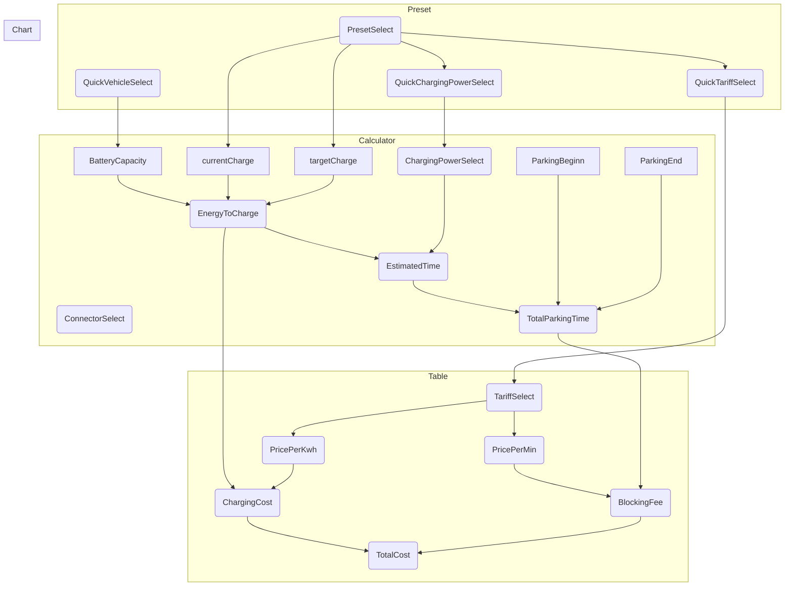

## Chart for connected attributes

```mermaid
graph TB
    %% values
    subgraph Preset
        QVS(QuickVehicleSelect)
        QCPS(QuickChargingPowerSelect)
        PS(PresetSelect)
        QTS(QuickTariffSelect)

        PS --> QCPS & QTS
    end

    subgraph Calculator
        BC[BatteryCapacity]
        CoS(ConnectorSelect)
        SoC_1[currentCharge]
        SoC_2[targetCharge]
        CPS(ChargingPowerSelect)
        PB[ParkingBeginn]
        PE[ParkingEnd]

        ETC(EnergyToCharge)
        ET(EstimatedTime)
        TPT(TotalParkingTime)

        BC --> ETC
        SoC_1 --> ETC
        SoC_2 --> ETC
    end

    QVS --> BC

    PS --> SoC_1 & SoC_2

    QCPS --> CPS


    ETC --> ET
    CPS ---> ET

    ET --> TPT

    PB & PE ----> TPT

    subgraph Table
        TS(TariffSelect)
        PPK(PricePerKwh)
        PPM(PricePerMin)
        CC(ChargingCost)
        BF(BlockingFee)
        TC(TotalCost)

        TS --> PPK
        TS --> PPM

        ETC --> CC
        PPK --> CC

        PPM --> BF
        TPT --> BF

        CC & BF --> TC
    end

    QTS ------> TS


    subgraph Chart

    end

```
